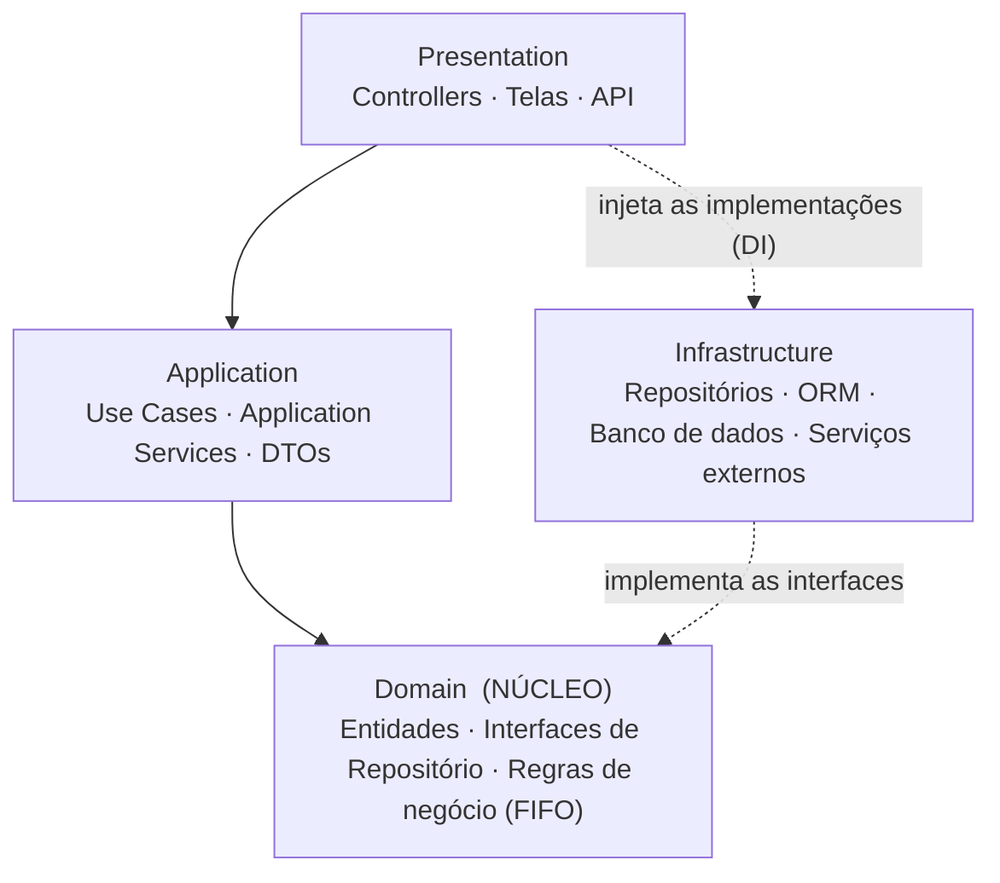
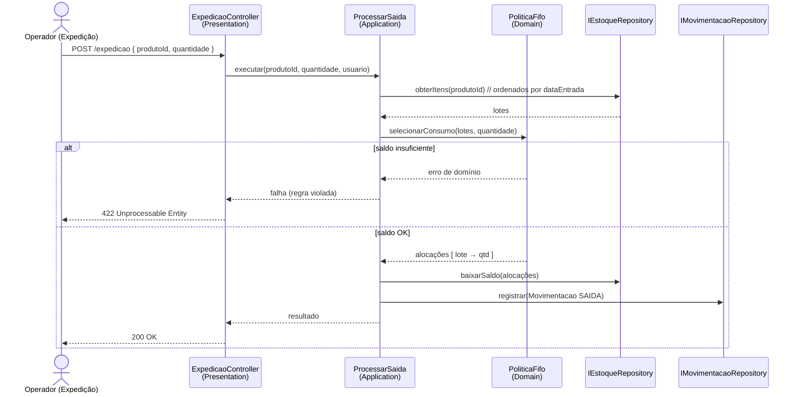

# WMS — Sistema de Gestão de Armazém (Onion Architecture)


## 1. O que é o sistema

Um **WMS (Warehouse Management System) compacto**, focado no **controle básico de estoque** e nas **movimentações logísticas internas** de uma empresa: gerenciar **entradas, armazenagem, transferências, saídas e a rastreabilidade** do saldo do estoque.

**Problema que resolve:** a dificuldade de controlar manualmente os processos logísticos — principalmente a contagem de estoque e a baixa rastreabilidade das operações.

**Usuários do sistema:**

| Perfil | Responsabilidade |
|---|---|
| Operador de estoque | Movimentações e transferências internas |
| Responsável pelo recebimento | Entrada e conferência de produtos |
| Responsável pela expedição | Saída de produtos (com FIFO) |
| Administrador | Cadastro de produtos, usuários e permissões |

---

## 2. Arquitetura escolhida: **Onion**

A solução é organizada em **camadas concêntricas**. O **domínio** (regras de negócio) fica no **centro** e **não depende de nada**. As camadas externas — aplicação, apresentação e infraestrutura — dependem das internas; **nunca o contrário**. Banco de dados e frameworks ficam na **borda**, então trocar o banco ou a tecnologia da interface **não afeta as regras de negócio**.

```
        ┌───────────────────────────────────────────────────┐
        │              PRESENTATION  (UI / API)             │
        │   ┌───────────────────────────────────────────┐   │
        │   │        APPLICATION  (casos de uso)        │   │
        │   │   ┌───────────────────────────────────┐   │   │
        │   │   │          DOMAIN  (núcleo)         │   │   │
        │   │   │   Entidades · Interfaces de       │   │   │
        │   │   │   repositório · Regras (FIFO)     │   │   │
        │   │   └───────────────────────────────────┘   │   │
        │   └───────────────────────────────────────────┘   │
        └───────────────────────────────────────────────────┘
                              ▲
                              │  implementa as interfaces do Domain
              ┌───────────────┴───────────────────────────────┐
              │   INFRASTRUCTURE  (repositórios, ORM, BD,      │
              │   serviços externos)                          │
              └───────────────────────────────────────────────┘
```



**Regra de dependência:** `Presentation → Application → Domain ← Infrastructure`.
A Infra implementa as **interfaces declaradas no Domain**; a ligação concreta é resolvida por **injeção de dependência** no ponto de composição (na Presentation / startup da aplicação).

### Por que Onion?

- Forte **divisão de responsabilidades** — regras de negócio desacopladas do resto da aplicação.
- Um WMS tem **regras de negócio complexas e específicas por cliente** → ficam organizadas num **núcleo independente**.
- Facilita **modularização**, **manutenção**, **arquivos pequenos com funções específicas** e **clareza estrutural**.
- Facilita **testes** de cada processo isoladamente (ex.: validar o FIFO sem banco de dados).
- Separa claramente **regras de domínio, casos de uso, acesso a dados e interface**.

---

## 3. Estrutura de pastas

```
WMS/
├── src/
│   ├── Domain/                       # NÚCLEO — regras de negócio (sem dependências externas)
│   │   ├── Entities/
│   │   │   ├── Produto
│   │   │   ├── EstoqueItem            # saldo por produto/localização/lote — guarda a data de entrada (FIFO)
│   │   │   ├── Localizacao
│   │   │   ├── Movimentacao
│   │   │   └── Usuario
│   │   ├── Enums/
│   │   │   ├── TipoMovimentacao       # ENTRADA · ARMAZENAGEM · TRANSFERENCIA · SAIDA · AJUSTE
│   │   │   └── PerfilUsuario          # OPERADOR · RECEBIMENTO · EXPEDICAO · ADMIN
│   │   ├── Interfaces/                # contratos de repositório  (padrão Repository)
│   │   │   ├── IProdutoRepository
│   │   │   ├── IEstoqueRepository
│   │   │   ├── IMovimentacaoRepository
│   │   │   └── IUsuarioRepository
│   │   └── Services/                  # serviços de domínio — regras puras
│   │       ├── PoliticaFifo           # seleciona os lotes mais antigos primeiro
│   │       └── CalculadoraSaldo       # consolida saldo por produto/localização
│   │
│   ├── Application/                   # CASOS DE USO — orquestra o domínio
│   │   ├── UseCases/
│   │   │   ├── Produtos/              # CadastrarProduto · AtualizarProduto · ConsultarProduto
│   │   │   ├── Recebimento/           # ProcessarEntrada · ArmazenarItem
│   │   │   ├── Movimentacao/          # TransferirSaldo
│   │   │   ├── Expedicao/             # ProcessarSaida   (aplica FIFO)
│   │   │   └── Rastreabilidade/       # RastrearMovimentacoes
│   │   ├── Services/                  # serviços de aplicação (fluxo operacional)
│   │   ├── DTOs/                      # objetos de entrada/saída dos casos de uso
│   │   └── Interfaces/                # contratos para a Infra (ex.: IUnitOfWork)
│   │
│   ├── Infrastructure/                # IMPLEMENTAÇÕES TÉCNICAS
│   │   ├── Persistence/
│   │   │   ├── AppDbContext           # mapeamento ORM
│   │   │   └── Migrations/
│   │   ├── Repositories/              # implementam as interfaces do Domain
│   │   │   ├── ProdutoRepository
│   │   │   ├── EstoqueRepository
│   │   │   ├── MovimentacaoRepository
│   │   │   └── UsuarioRepository
│   │   ├── ExternalServices/          # integrações com outros sistemas (opcional)
│   │   └── DependencyInjection        # registro das implementações para DI
│   │
│   └── Presentation/                  # INTERFACE — API REST / Web / Mobile
│       ├── Controllers/               # (ou Endpoints)
│       │   ├── ProdutosController
│       │   ├── RecebimentoController
│       │   ├── MovimentacaoController
│       │   ├── ExpedicaoController
│       │   └── RastreabilidadeController
│       ├── Views/                     # telas / dashboards (se houver front-end aqui)
│       └── Program / Startup          # composição da aplicação + configuração de DI
│
└── tests/
    ├── Domain.Tests/                  # regras puras: FIFO, cálculo de saldo, validações
    └── Application.Tests/             # casos de uso com repositórios fake/mock
```

> ℹ️ **Implementação real (TypeScript):** as pastas concretas deste repositório são `src/domain`, `src/application`, `src/infrastructure` e `src/presentation` — a árvore exata e os comandos estão na **seção 15**.

---

## 4. As quatro camadas em detalhe

### 4.1 Domain (núcleo)
Coração da aplicação. Contém **entidades**, **enums**, **interfaces de repositório** e **serviços de domínio** com as regras de negócio (incluindo o **FIFO**). **Não referencia** banco de dados, framework web nem nenhuma outra camada — depende só de si mesmo. Aqui o encapsulamento é forte: as entidades carregam dados **e** o comportamento que os mantém válidos.

### 4.2 Application
**Casos de uso** e **serviços de aplicação** — orquestram o domínio para realizar uma operação completa (ex.: "processar uma saída"). Depende **apenas do Domain**. Define DTOs de entrada/saída e, quando precisa de algo da infra (transações, e-mail, etc.), depende de **interfaces**, não de implementações.

### 4.3 Infrastructure
Implementa as **interfaces declaradas no Domain** (e na Application): repositórios concretos, `DbContext`/ORM, acesso ao banco, integrações externas. Depende do **Domain** (para conhecer as interfaces e entidades). É **substituível** — trocar de SGBD mexe só aqui.

### 4.4 Presentation
Interface com o usuário: **API REST**, controllers, telas, dashboards de estoque, relatórios de rastreabilidade. É o **ponto de composição**: monta o grafo de dependências (DI) ligando interfaces do Domain às implementações da Infra. Depende da **Application** (e, no startup, da Infra apenas para registrá-la).

---

## 5. Modelo de domínio (entidades principais)

| Entidade | Atributos principais | Observações |
|---|---|---|
| **Produto** | `id`, `sku`, `nome`, `descricao`, `unidadeMedida`, `ativo` | Cadastro/atualização e consulta de produtos |
| **Localizacao** | `id`, `codigo`, `descricao` | Endereço de armazenagem dentro do armazém |
| **EstoqueItem** | `id`, `produtoId`, `localizacaoId`, `quantidade`, `dataEntrada` | Saldo de um produto em uma localização para um recebimento; `dataEntrada` é a chave do **FIFO** |
| **Movimentacao** | `id`, `tipo`, `produtoId`, `quantidade`, `localizacaoOrigemId`, `localizacaoDestinoId`, `dataHora`, `usuarioId`, `documentoReferencia` | Registro imutável de **toda** entrada, saída, armazenagem e transferência — base da rastreabilidade |
| **Usuario** | `id`, `nome`, `login`, `senhaHash`, `perfil` | `perfil` ∈ `OPERADOR · RECEBIMENTO · EXPEDICAO · ADMIN` (controle de acesso básico) |

`TipoMovimentacao` = `ENTRADA · ARMAZENAGEM · TRANSFERENCIA · SAIDA · AJUSTE`.

---

## 6. Funcionalidades / Casos de uso

| Requisito (escopo) | Caso de uso | Camada que orquestra |
|---|---|---|
| Cadastro / atualização de produtos | `CadastrarProduto`, `AtualizarProduto` | Application → Domain |
| Consulta de produtos | `ConsultarProduto`, `ListarProdutos` | Application → Domain |
| Recebimento / entrada de estoque | `ProcessarEntrada` | Application → Domain (registra `Movimentacao` ENTRADA + cria `EstoqueItem`) |
| Armazenagem dos itens recebidos | `ArmazenarItem` | Application → Domain (define a `Localizacao` do `EstoqueItem`) |
| Movimentações e transferências | `TransferirSaldo` | Application → Domain (baixa origem, soma destino, registra `Movimentacao` TRANSFERENCIA) |
| Expedição / saída de estoque | `ProcessarSaida` | Application → Domain (**aplica FIFO** e registra `Movimentacao` SAIDA) |
| Rastreabilidade de todas as operações | `RastrearMovimentacoes` | Application → Domain (consulta o histórico de `Movimentacao`) |
| Regra de negócio **FIFO** | `PoliticaFifo` (serviço de domínio) | Domain |

---

## 7. Regra de negócio principal: **FIFO** (*First In, First Out*)

Na **saída/expedição**, o estoque consumido é sempre o **mais antigo primeiro**. O serviço de domínio `PoliticaFifo`:

1. Recebe os `EstoqueItem` do produto **ordenados por `dataEntrada` (crescente)**.
2. Vai alocando a quantidade pedida lote a lote até completá-la.
3. Se o saldo total for insuficiente → a operação é **rejeitada** (regra de domínio, sem efeito colateral).
4. Devolve as **alocações** (`lote → quantidade`); a Application aplica as baixas e registra a `Movimentacao` de SAIDA.

Como `PoliticaFifo` é uma função pura de domínio, dá para **testá-la sem banco de dados**.

---

## 8. Padrões de projeto usados

| Padrão | Para quê | Onde |
|---|---|---|
| **Repository** | Abstrair o acesso a dados — o domínio não conhece o banco | Interfaces em `Domain/Interfaces`, implementações em `Infrastructure/Repositories` |
| **Dependency Injection** | Desacoplar serviços das implementações concretas; facilitar manutenção e testes | Registro em `Infrastructure/DependencyInjection`, resolvido no startup (Presentation) |
| **Service Layer** | Organizar casos de uso e fluxos operacionais | `Application/UseCases` e `Application/Services` |

---

## 9. Relação com POO e SOLID

- **Abstração** — interfaces de repositório e de serviços; o domínio fala com contratos, não com classes concretas.
- **Encapsulamento** — as entidades do domínio guardam dados **e** o comportamento/validações que os mantêm consistentes.
- **Inversão de dependência (D do SOLID)** — camadas internas dependem de **abstrações**; as concretas são injetadas (DI), mantendo o domínio desacoplado.
- **Responsabilidade única (S)** — cada camada/arquivo tem um papel específico → aplicação modular e organizada.
- **Aberto/fechado (O)** — novos casos de uso e serviços entram **sem alterar o domínio**.

---

## 10. Exemplo de fluxo — Saída com FIFO



---

## 11. Requisitos arquiteturais (resumo do documento)

| Requisito | Importante porque… | Onde aparece | Como a Onion ajuda |
|---|---|---|---|
| **Manutenibilidade** | Regras de estoque mudam com frequência | Entradas, saídas, movimentações | Separa domínio de infraestrutura; código em camadas/módulos pequenos |
| **Modularidade / baixo acoplamento** | Separar responsabilidades | Serviços, domínio, persistência | Cada camada tem papel específico; interfaces, serviços e repositórios |
| **Testabilidade** | Validar regras (FIFO) isoladamente | Regras FIFO e movimentações | Domínio desacoplado da infra → testes sem banco |
| **Segurança** | Controle de acesso ao sistema | Operações de estoque e login | Separação facilita controle de acesso; perfis de usuário |
| **Desempenho** | Operações de estoque precisam ser rápidas | Consultas e movimentações | Persistência isolada → fácil de otimizar/indexar sem mexer no domínio |
| **Escalabilidade** | Incluir funcionalidades no futuro | Novos módulos/operações | Estrutura modular; novos serviços sem alterar o domínio |
| **Disponibilidade / confiabilidade** | Controle de estoque precisa ser confiável | Atualização e rastreio de saldo | Organização reduz impacto de falhas entre módulos; validações + rastreabilidade |
| **Integração / interoperabilidade** | Comunicação organizada entre camadas | Persistência e BD | Onion desacopla domínio e infra; interfaces/repositórios separados da lógica |

---

## 12. Riscos e trade-offs (resumo)

**Riscos**

| Risco | Por quê | Mitigação |
|---|---|---|
| Complexidade excessiva da arquitetura | Muitas camadas dificultam o início | Manter escopo reduzido; evitar abstrações desnecessárias |
| Fronteiras mal definidas entre camadas | Pode gerar acoplamento domínio↔infra | Responsabilidades claras por camada |
| Excesso de abstrações | Aumenta a complexidade | Usar interface/abstração só quando necessário |

**Trade-offs**

| Trade-off | Favorece | Dificulta | Como lidar |
|---|---|---|---|
| Desacoplamento × Complexidade | Organização e manutenção | Mais camadas e arquivos | Manter estrutura simples e objetiva |
| Testabilidade × Tempo de dev | Testar regras de negócio | Início mais demorado | Escopo reduzido e focado |
| Modularidade × Curva de aprendizado | Separação clara de responsabilidades | Organização inicial mais difícil | Seguir o padrão arquitetural definido |
| Independência do domínio × Nº de interfaces | Regras desacopladas | Mais interfaces e serviços | Abstrair só quando necessário |
| Manutenção futura × Complexidade inicial | Evolução do sistema | Mais planejamento estrutural | Limitar funcionalidades ao escopo principal |

---

## 13. Stack (flexível)

O domínio é **independente de tecnologia**. A mesma arquitetura pode ser implementada em **C#/.NET**, **Java/Spring**, **Node.js/TypeScript** ou **Python**, com um banco relacional (**PostgreSQL / MySQL / SQLite**). A escolha da linguagem, do ORM ou do framework web **não muda a arquitetura** — muda só a camada de Infrastructure e Presentation.

> **Implementação de referência neste repositório:** TypeScript + Node.js + Express na Presentation; persistência num **arquivo JSON** na Infra (`data/wms-db.json` — sem SGBD, mas dá para trocar por um banco de verdade sem encostar no Domain/Application). Detalhes na **seção 15**.

---

## 14. Ordem de construção (já seguida neste repositório ✅)

1. ✅ Criar o projeto com as quatro camadas (`src/domain`, `src/application`, `src/infrastructure`, `src/presentation`).
2. ✅ Modelar as entidades e enums no **Domain**.
3. ✅ Declarar as **interfaces de repositório** no Domain e o serviço `PoliticaFifo`.
4. ✅ Implementar os **casos de uso** na Application (Produtos, Recebimento, Armazenagem, Transferência, Expedição, Rastreabilidade, Saldo).
5. ✅ Implementar os **repositórios** na Infrastructure (persistência em arquivo JSON — prontos para virar um banco real).
6. ✅ Expor a **API REST** na Presentation e configurar a **injeção de dependência** (composition root em `presentation/container.ts`).
7. ✅ Escrever **teste do domínio** para a regra FIFO.

**Evoluções possíveis:** banco de dados real (Prisma/TypeORM + PostgreSQL); autenticação/login usando os perfis de usuário; validação de entrada na borda (zod); front-end (dashboard de estoque); mais testes (casos de uso e API).

---

## 15. Implementação em TypeScript

### Stack
Node.js + TypeScript · Express (API REST) · Vitest (testes) · `tsx` (execução em dev). O "banco" é um **arquivo JSON** (`data/wms-db.json`) — não há SGBD, mas os dados **persistem entre execuções**. Os repositórios implementam as mesmas interfaces do Domain, então trocar o JSON por um banco de verdade mexe **só na camada de Infra**.

### Estrutura real de pastas

```
src/
├── domain/                       # NÚCLEO — regras de negócio, sem dependências externas
│   ├── entities/                 # Produto, Localizacao, EstoqueItem, Movimentacao, Usuario
│   ├── enums/                    # TipoMovimentacao, PerfilUsuario
│   ├── errors/DomainError.ts     # erro de regra de negócio (-> HTTP 422)
│   ├── repositories/             # interfaces: IProdutoRepository, IEstoqueRepository, ...
│   ├── services/PoliticaFifo.ts  # regra FIFO (função pura de domínio)
│   └── validacao.ts              # validadores reutilizados pelas entidades
├── application/
│   └── use-cases/
│       ├── produtos/             # CadastrarProduto, AtualizarProduto, ConsultarProduto
│       ├── recebimento/          # ProcessarEntrada, ArmazenarItem
│       ├── movimentacao/         # TransferirSaldo
│       ├── expedicao/            # ProcessarSaida  (aplica FIFO)
│       ├── estoque/              # ConsultarSaldo
│       └── rastreabilidade/      # RastrearMovimentacoes
├── infrastructure/
│   ├── persistence/
│   │   └── JsonDatabase.ts       # o "banco": carrega/grava o arquivo data/wms-db.json
│   └── repositories/             # JsonFile*Repository — implementam as interfaces do Domain
└── presentation/
    ├── container.ts              # composition root: instancia repos e injeta nos casos de uso (DI)
    ├── server.ts                 # sobe o Express
    └── http/
        ├── routes.ts
        ├── asyncHandler.ts
        ├── errorHandler.ts
        └── controllers/          # ProdutosController, RecebimentoController, ...
tests/
└── domain/PoliticaFifo.test.ts   # testa a regra FIFO isoladamente (sem banco, sem HTTP)
```

### Persistência (arquivo JSON)
O arquivo **`data/wms-db.json`** é o "banco": é criado na primeira execução (já com usuários e localizações de exemplo) e reescrito a cada operação. É só um objeto com uma "tabela" por array:

```json
{
  "produtos": [ ... ],
  "localizacoes": [ ... ],
  "estoque": [ ... ],
  "movimentacoes": [ ... ],
  "usuarios": [ ... ]
}
```

- **Resetar o banco:** apague a pasta `data/` — na próxima execução ela é recriada vazia + dados de exemplo.
- **Usar outro arquivo:** defina a variável de ambiente `WMS_DB` com o caminho desejado.
- A conversão *linha do JSON ⇄ entidade de domínio* fica nos repositórios (`infrastructure/repositories/JsonFile*Repository.ts`) e no `infrastructure/persistence/JsonDatabase.ts` — o Domain não sabe que existe um JSON.

### Como rodar

```bash
npm install        # instala as dependências
npm run dev        # sobe a API com reload em http://localhost:3333 (imprime IDs de exemplo)
npm test           # roda os testes (Vitest)
npm run typecheck  # confere os tipos (tsc --noEmit)
npm run build      # compila para dist/
```

Ao subir, o console mostra IDs de **usuários** e **localizações** (criados por `seed()` na primeira execução, depois só relidos do arquivo) — use-os no corpo das requisições. Também dá para descobri-los em `GET /api/usuarios` e `GET /api/localizacoes`.

### Endpoints (REST, base `/api`)

| Funcionalidade do PDF | Método | Rota | Corpo (resumo) |
|---|---|---|---|
| Cadastro de produto | `POST` | `/produtos` | `{ sku, nome, unidadeMedida, descricao? }` |
| Atualização de produto | `PUT` | `/produtos/:id` | `{ nome?, descricao?, unidadeMedida?, ativo? }` |
| Consulta de produtos | `GET` | `/produtos` · `/produtos/:id` | — |
| Recebimento / entrada | `POST` | `/recebimentos` | `{ produtoId, quantidade, usuarioId, localizacaoId?, documentoReferencia? }` |
| Armazenagem | `POST` | `/armazenagens` | `{ estoqueItemId, localizacaoId, usuarioId }` |
| Transferência | `POST` | `/transferencias` | `{ produtoId, localizacaoOrigemId, localizacaoDestinoId, quantidade, usuarioId }` |
| Expedição / saída (FIFO) | `POST` | `/expedicoes` | `{ produtoId, quantidade, usuarioId, documentoReferencia? }` |
| Consulta de saldo | `GET` | `/estoque/:produtoId` | — |
| Rastreabilidade | `GET` | `/movimentacoes?produtoId=` | — |
| (apoio) usuários / localizações | `GET` | `/usuarios` · `/localizacoes` | — |

Regras de negócio violadas (produto inexistente, saldo insuficiente, etc.) retornam **HTTP 422** com `{ "erro": "..." }`.

### Exemplo de fluxo (curl)

```bash
# 1) cadastra um produto  ->  guarde o "id" como PRODUTO_ID
curl -s -X POST localhost:3333/api/produtos -H 'Content-Type: application/json' \
  -d '{"sku":"CANETA-AZUL","nome":"Caneta Azul","unidadeMedida":"UN"}'
# pegue um USUARIO_ID em:  curl -s localhost:3333/api/usuarios

# 2) duas entradas (lotes com datas diferentes -> base do FIFO)
curl -s -X POST localhost:3333/api/recebimentos -H 'Content-Type: application/json' \
  -d '{"produtoId":"PRODUTO_ID","quantidade":10,"usuarioId":"USUARIO_ID"}'
curl -s -X POST localhost:3333/api/recebimentos -H 'Content-Type: application/json' \
  -d '{"produtoId":"PRODUTO_ID","quantidade":5,"usuarioId":"USUARIO_ID"}'

# 3) saldo (15) -> expede 12 -> consome todo o 1º lote + 2 do 2º -> saldo 3
curl -s localhost:3333/api/estoque/PRODUTO_ID
curl -s -X POST localhost:3333/api/expedicoes -H 'Content-Type: application/json' \
  -d '{"produtoId":"PRODUTO_ID","quantidade":12,"usuarioId":"USUARIO_ID","documentoReferencia":"PED-001"}'

# 4) histórico completo (rastreabilidade)
curl -s "localhost:3333/api/movimentacoes?produtoId=PRODUTO_ID"
```

---

## Agentes do projeto

Foram adicionados dois subagentes em [`.claude/agents/`](.claude/agents/), conforme anexado:

- **[backend-architect](.claude/agents/backend-architect.md)** — design de sistema escalável, arquitetura de banco/dados, APIs e infraestrutura.
- **[code-reviewer](.claude/agents/code-reviewer.md)** — revisão de código construtiva, focada em correção, segurança, manutenibilidade e performance.

Para usá-los no Claude Code: `@backend-architect ...` ou `@code-reviewer ...` (ou deixe o Claude delegar automaticamente quando a tarefa combinar com a descrição do agente).
